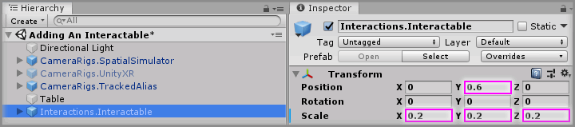

# Adding An Interactable

> * Level: Beginner
>
> * Reading Time: 5 minutes
>
> * Checked with: Unity 2018.3.14f1

## Introduction

An `Interactions.Interactable` prefab provides GameObject that can be interacted with in the virtual world via an `Interactions.Interactor` prefab. Interactable GameObjects can be notified of actions that the Interactor is performing such as being touched by an Interactor or reacting to actions such as a grab button being pressed.

By default, Interactable GameObjects can usually perform two actions depending on which Interactor is acting upon them. A common use case is a scene with a Left and Right Controller, both capable of grabbing the Interactable GameObject and carrying it in some way, the first grab attempt from an Interactor is called the `Primary Grab Action` and whilst this is occurring any second grab attempt from a different Interactor is called the `Secondary Grab Action`.

This guide will show how to set up an `Interactions.Interactable` prefab that we can grab with either of our controllers and when we grab it with the other controller, the Interactable GameObject will swap hands as if we had passed the GameObject between our virtual hands.

## Prerequisites

* [Add the Tilia.Interactions.Interactor.Unity -> Interactions.Interactor] prefab to the scene hierarchy.
* [Install the Tilia.Interactions.Interactables.Unity] package dependency in to your [Unity] project.

## Let's Start

### Step 1

Before we begin adding the `Interactions.Interactable` prefab to the scene, let’s create a simple surface that the `Interactions.Interactable` prefab will rest on as Interactable GameObjects have a `Rigidbody` component which means they are affected by the gravity in our virtual world. If an `Interactions.Interactable` prefab was added to a blank scene then when the scene was played it would just fall infinitely as the virtual world gravity would apply to it and pull it down until it collided with a solid surface.

Create a new `Cube` Unity 3D Object by selecting `Main Menu -> GameObject -> 3D Object -> Cube` and rename the new `Cube` to `Table`.

### Step 2

Add a `Interactions.Interactable` prefab to the Unity project hierarchy by selecting `GameObject -> Tilia -> Prefabs -> Interactions -> Interactables -> Interactions.Interactable` from the Unity main top menu.

### Step 3

We’re going to change the scale and position of the `Interactions.Interactable` GameObject as by default it’s just a `1 x 1 x 1` Cube, which will be very big in our virtual world.

Select the `Interactions.Interactable` GameObject and set the `Transform` properties to:

* Position: `X = 0`, `Y = 0.6`, `Z = 0`
* Scale: `X = 0.2`, `Y = 0.2`, `Z = 0.2`

### Step 4

Select the `Interactions.Interactable` GameObject in the Unity Hierarchy window and change the `Primary Action` property to `Interactable.GrabAction.Follow` and change the `Secondary Action` property to `Interactable.GrabAction.Swap` on the `Interactable Facade` component.

### Done

Play the Unity scene and touch the `Interactions.Interactable` GameObject with either the Left or Right Controller. The Interactors on the touching Controller will tell the `Interactions.Interactable` GameObject that it is being touched and then pressing the Grab Button down on the Controller will initiate the Grab Action and make the `Interactions.Interactable` GameObject follow our grabbing Controller around.

You can grab the `Interactions.Interactable` GameObject with the other Controller to swap the grab to the other hand and you can also throw the `Interactions.Interactable` GameObject and release the `Grab` Action apply the Controller velocity which will throw the `Interactions.Interactable` GameObject.

[Add the Tilia.Interactions.Interactor.Unity -> Interactions.Interactor]: ../AddingAnInteractor/README.md
[Install the Tilia.Interactions.Interactables.Unity]: ../Installation/README.md
[Unity]: https://unity3d.com/
