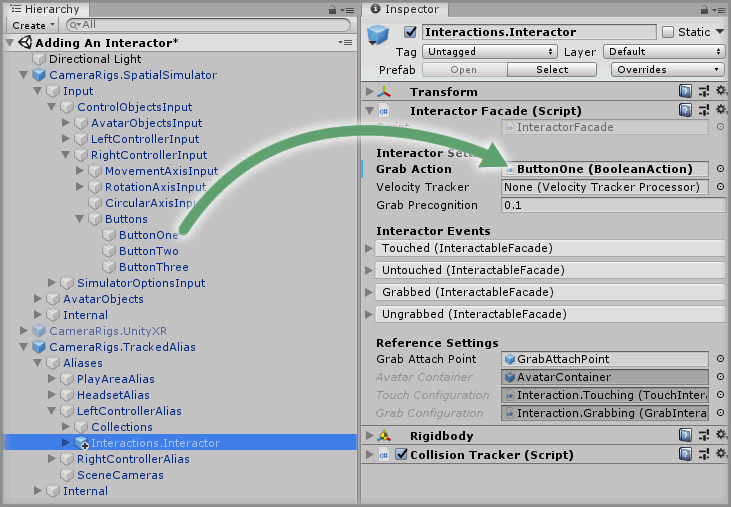
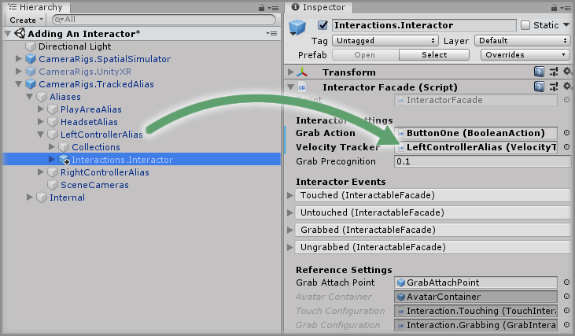

# Adding An Interactor

> * Level: Beginner
>
> * Reading Time: 10 minutes
>
> * Checked with: Unity 2018.3.14f1

## Introduction

The first step into interacting with virtual objects is to define an interactor, which is a concept of something that knows when it is touching an interactable object as well as being able to grab the object to affect it in some way.

The Interactor prefab can be added to any GameObject that we want to be able to touch and grab interactable objects. In this guide we’ll look at making the virtual controllers work as interactors so we can simulate picking up virtual objects with our virtual hands.

## Prerequisites

* [Add the Tilia.CameraRigs.TrackedAlias.Unity] prefab to the scene Hierarchy.
* [Install the Tilia.Interactions.Interactables.Unity] package dependency in to your [Unity] project.

## Let's Start

### Step 1

The `Interactions.Interactor` prefab comes with an `ExampleAvatar` GameObject, which provides a basic representation of the Interactor containing a simple cube mesh and a simple cube collider. These can be changed to suit whatever purpose you may have, but for this example, we’ll keep the `ExampleAvatar` GameObject untouched.

> If you followed the [Add the Tilia.CameraRigs.TrackedAlias.Unity] guide and added in custom GameObjects for controller avatars, you can delete them now as the `ExampleAvatar` GameObject will provide us with a basic controller avatar instead.

Expand the `Tilia Interactors Interactables Unity` Package directory in the Unity Project window and select the `Packages -> Tilia Interactors Interactables Unity -> Runtime -> Interactors -> Prefabs` directory. For this example, we’re going to add the `Interactions.Interactor` prefab to our controller aliases within our `CameraRigs.TrackedAlias` prefab, so expand the `CameraRigs.TrackedAlias` prefab in the Unity Hierarchy window until the `LeftControllerAlias` and `RightControllerAlias` GameObjects are visible.

Drag and drop the `Interactions.Interactor` prefab to be a child of the `LeftControllerAlias` then drag and drop another `Interactions.Interactor` prefab to be a child of the `RightControllerAlias`.

> Note: The following steps will be carried out on both the `LeftControllerAlias` and the `RightControllerAlias` but the instructions will only outline the steps once, so be sure to carry them out for both controller aliases.

### Step 2

Select the `Interactions.Interactor` prefab in the Unity Hierarchy under the `LeftControllerAlias` GameObject and change the `Interactor Facade` component to configure the base functionality of the Interactor.

We need to specify an action that initiates the Interactor’s Grab notification. The Grab Action parameter on the Interactor Facade allows us to provide a `Boolean Action` to initiate the Grab function of the Interactor.

For this example we will set up the interactors to use the simulator controls utilizing the mouse.

Expand the `CameraRigs.SpatialSimulator -> Input -> Control Objects Input -> Right Controller Input -> Buttons` GameObject.

`Button One` is the left mouse button and we'll use this to activate the grab action on our left interactor so drag and drop the `Button One` GameObject into the `Grab Action` parameter on the `Interactor Facade` component on the `Interactions.Interactor` prefab nested inside `LeftControllerAlias` GameObject

> Note: Be sure to do the same with the `Button Two` GameObject and the `RightControllerAlias -> Interactions.Interactor` prefab.

### Step 3

When an Interactor grabs an interactable object, it is usually required that the velocity that the Interactor is moving at can be applied to the interactable object. For example, if we were to pick up an interactable object and throw it, then we would want the velocity that we’re moving our virtual controller at to be applied to the interactable object so we can control the power of the throw.

The `Velocity Tracker` parameter on the `Interactor Facade` component allows us to specify a velocity tracking component that will provide the relevant velocity data. Fortunately, our `CameraRigs.TrackedAlias` prefab already comes with the relevant `Velocity Tracker` components on the relevant aliases that can move freely in the virtual world such as the Headset, Left Controller and Right Controller.

Drag and drop the `CameraRigs.TrackedAlias -> Aliases -> LeftControllerAlias` GameObject into the `Velocity Tracker` parameter on the `Interactor Facade` component for the `Interactions.Interactor` prefab nested under the `LeftControllerAlias` GameObject to set the interactor to track velocities from our Left Controller.

> Note: Be sure to do the same with the `RightControllerAlias` GameObject and the `RightControllerAlias -> Interactions.Interactor` prefab.

### Done

We now have an `Interactions.Interactor` prefab attached to our `CameraRigs.TrackedAlias -> Aliases -> LeftControllerAlias` and our `CameraRigs.TrackedAlias -> Aliases -> RightControllerAlias` and Interactors will follow the Alias GameObjects as if they are children of the GameObjects in the Unity Hierarchy. At the moment, these Interactors won’t do anything special in our scene because there is nothing to interact with.

[Add the Tilia.CameraRigs.TrackedAlias.Unity]: https://github.com/ExtendRealityLtd/Tilia.CameraRigs.TrackedAlias.Unity/tree/master/Documentation/HowToGuides/AddingATrackedAlias
[Install the Tilia.Interactions.Interactables.Unity]: ../Installation/README.md
[Unity]: https://unity3d.com/