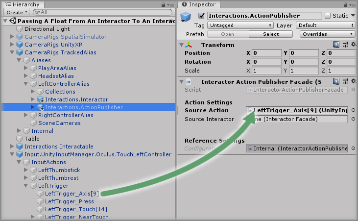
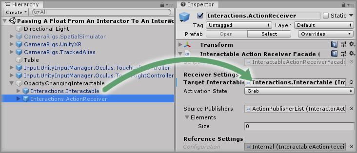
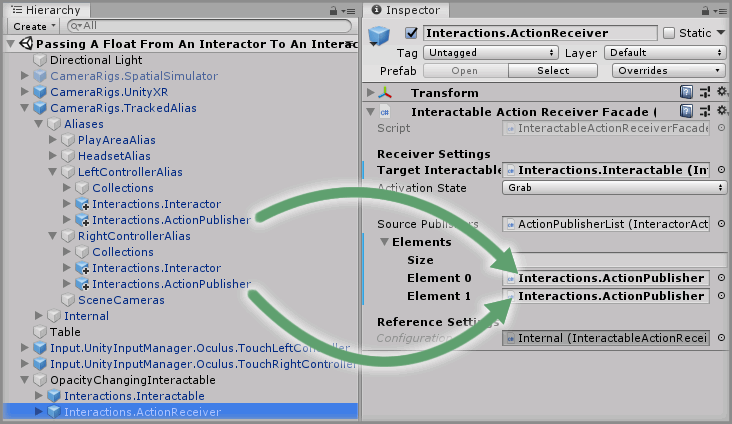
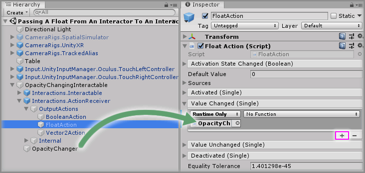

# Passing A Float From An Interactor To An Interactable

> * Level: Intermediate
>
> * Reading Time: 10 minutes
>
> * Checked with: Unity 2018.3.14f1

## Introduction 

By default, the Interactor can only pass a single boolean action over to an Interactable, which controls the grab action on the Interactable. There are other times when other actions from an Interactor may want to be passed over to an Interactable such as another input button press or even the axis value from a controller such as a trigger squeeze.

We can use the `Interactions.ActionPublisher` and `Interactions.ActionReceiver` prefabs to facilitate this mechanism.

## Prerequisites

* [Add the Tilia.Interactions.Interactable.Unity] prefab to the scene Hierarchy.

## Let's Start

### Step 1

Disable `CameraRigs.SpatialSimulator` and enable `CameraRigs.UnityXR`


### Step 2

Expand the `Tilia Input UnityInputManager` Package directory in the Unity Project window and select the `Packages -> Runtime -> Prefabs -> ControllerMappings` directory. For this example we are going to add the `Input.UnityInputManager.Oculus.TouchLeftController` prefab and the `Input.UnityInputManager.Oculus.TouchRightController`prefab.

Drag and Drop those two items into the Unity Scene.


### Step 3

We need to update our Interactors to listen to the Grip Button on our controller to grab the object. Expand `CameraRigs.TrackedAlias` and find the Interactors in the `LeftControllerAlias` and `RightControllerAlias`.

For the `LeftControllerAlias`, expand `CameraRigs.TrackedAlias -> Aliases -> LeftControllerAlias` GameObject and click on the `Interactions.Interactor` GameObject.

Expand the `Input.UnityInputManager.Oculus.TouchLeftController -> Input Actions -> LeftGrip` GameObject then drag and drop the `LeftGrip_Press` GameObject onto the `Grab Action` parameter on the `Interactor Facade` component of the `CameraRigs.TrackedAlias -> Aliases -> LeftControllerAlias -> Interactions.Interactor` GameObject. 


> Do the same with the right controller.

### Step 4

Expand the `Tilia Interactions Interactables Unity` Package directory in the Unity project window and select the `Packages -> Tilia Interactions Interactables Unity -> Runtime -> Interactors -> Prefabs` directory then drag and drop the `Interactions.ActionPublisher` into the `CameraRigs.TrackedAlias -> Aliases -> LeftControllerAlias`.


Expand the `Input.UnityInputManager.Oculus.TouchLeftController -> Input Actions -> LeftTrigger` GameObject until you can see the `LeftTrigger_Axis[9]` GameObject, select the `Interactions.ActionPublisher` and drag and drop the `LeftTrigger_Axis[9]` GameObject into the `Source Action` property on the `Interactor Action Publisher Facade` component.



> Do the same with the right controller.

### Step 5

Drag and drop the `Interactions.Interactor` GameObject embedded within the `LeftControllerAlias` into the `Source Interactor` property on the `Interactor Action Publisher Facade` component.


> Do the same with the right controller.

### Step 6

The `Publisher Indentifier` property is what groups the action publishers to the same final action receiver, so for these two triggers we want them to have the same publisher identifier value. Set the `Publisher Identifier` for both the left `Interactions.ActionPublisher` and the right `Interactions.ActionPublisher` to `TriggerPublisher`.


### Step 7

Before we set up the Interactable lets create a container GameObject for all this logic. Create a new GameObject and name it `OpacityChangingInteractable`. Set its position to match that of the `Interactions.Interactable` GameObject.

Position: `X = 0`, `Y = 0.6`, `Z = 0`


then drag and drop the `Interactions.Interactable` GameObject to be a child of the `OpacityChangingInteractable` GameObject.


### Step 8

Expand the `Tilia Interactions Interactables Unity` Package directory in the Unity project window and select the `Packages -> Tilia Interactions Interactables Unity -> Runtime -> Interactors -> Prefabs` directory then drag and drop the `Interactions.ActionReceiver` as a child of the `OpacityChangingInteractable` GameObject


### Step 9

Drag and drop the `Interactions.Interactable` GameObject nested within the `OpacityChangingInteractable` GameObject into the `Target Interactable` property on the `Interactable.ActionReceiver Facade` component on the `OpacityChangingInteractable -> Interactions.ActionReceiver` GameObject.



### Step 10

Select the `OpacityChangingInteractable -> Interactions.ActionReceiver` GameObject in the Unity hierachy window then increase the `Source Publishers -> Elements -> Size` property by `2` on the `Interactable Action Receiver Facade`.

> The property will be 0 by default so change it to 2


### Step 11

Add the 2 `Interactions.ActionPublisher` GameObjects we created for the `LeftControllerAlias` and the `RightControllerAlias` to the newly created Elements.

Drag and drop the `CameraRigs.TrackedAlias -> Aliases -> LeftControllerAlias -> Interactions.ActionPublisher` GameObject from the Unity hierachy window into the newly displayed Element `0` field within the `Source Publisher Elements` parameter on the `Interactable Action Receiver Facade`. Make sure to do the same for the `RightControllerAlias`.



### Step 12

Expand the `OpacityChangingInteractable -> Interactions.ActionReceiver` GameObject and then expand the `OutputActions` GameObject, you'll see 3 action GameObjects.

* `Boolean Action` - This will be used if the input action from our controller is a boolean e.g. a button.
* `Float Action` - This will be used if the input action from our controller is 1D Axis e.g. a trigger press.
* `Vector2 Action` - This will be used if the input action from our controller is like a trackpad movement.

In this example we are going to use the `Float Action` because we are going to use a trigger press.

### Step 13

We'll need to create a small script that allows us to change the opacity of our interactable GameObject to test that the trigger value from the controller passes over to the interactable.

Create a new script by selecting `Main Menu -> Assets -> Create -> C# Script` in the Unity software and name it `OpacityChanger`.

Copy and paste the below code into the newly created `OpacityChanger` script:

```
using UnityEngine;

public class OpacityChanger : MonoBehaviour
{
    public GameObject meshToChange;

    protected MeshRenderer materialRenderer;

    protected void OnEnable()
    {
        materialRenderer = meshToChange.GetComponentInChildren<MeshRenderer>();
    }

    public void ChangeOpacity(float value)
    {
        Color currentColor = materialRenderer.material.color;
        currentColor.a = 1f - value;
        materialRenderer.material.color = currentColor;
    }
}
```

This simple script has a single method called `ChangeOpacity` which will take a float value that sets the opacity of the material that is used on the GameObject.

Create a new GameObject as a child of the `OpacityChangingInteractable` and name it `OpacityChanger`. Then add the new `OpacityChanger` component to the GameObject.

### Step 14

We need to tell our `OpacityChanger` component what mesh to change. Drag and Drop the `Interactions.Interactable` GameObject into the `Mesh to Change` property on the `OpacityChanger` component.


### Step 15

Create a new material by selecting `Main Menu -> Assets -> Create -> Material` in the Unity software and name it `ChangingMaterial`. 

Change the `Rendering Mode` property on the `ChangingMaterial` material to `Transparent`.


> You could change the `Albedo` property on the `ChangingMaterial` material to another color using the color wheel.

### Step 16

Drag and drop the `ChangingMaterial` material from the Unity project assets onto the interactable cube in the Unity scene.


### Step 17

Now to set up the `OpacityChanger` component to work when the trigger is pressed on either of the controllers.

Expand the `OpacityChangingInteractable -> Interactions.ActionReceiver -> OutputActions` GameObject and select the nested `FloatAction` GameObject.

Click the `+` symbol in the bottom right corner of the `Value Changed` event parameter in the `Float Action` component and then drag and drop the `OpacityChanger` GameObject into the box that appears and displays `None (Object)`.



Select a `Function` to perform when the `Value Changed` event is emitted. For this example, select the `OpacityChanger -> ChangeOpacity` (be sure to select `Dynamic float - ChangeOpacity` for this example).


### Done

Play the Unity scene, you can grab the cube with the grip on the VR controller and whilst the object is grabbed, pressing the trigger will slowly change the opacity of the GameObject.

[Add the Tilia.Interactions.Interactable.Unity]: ../AddingAnInteractable/README.md