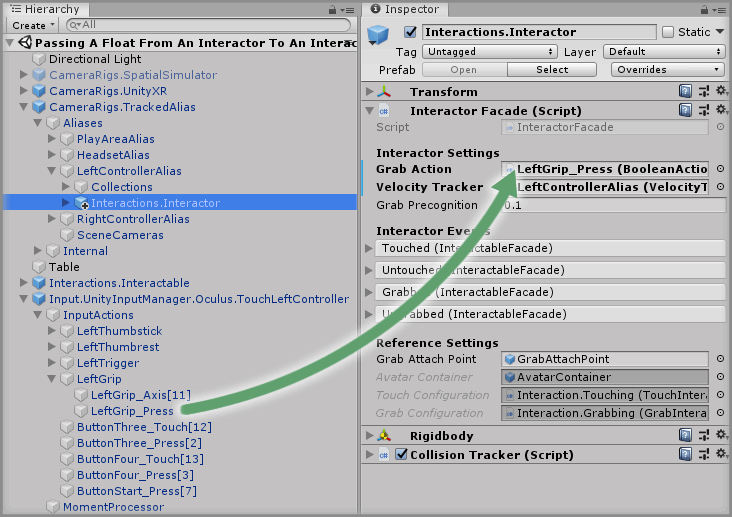
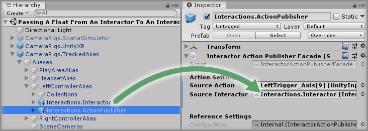
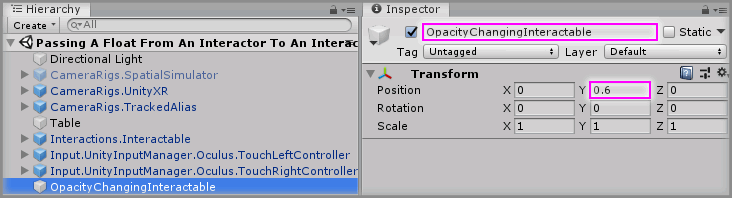
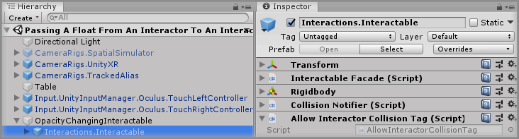
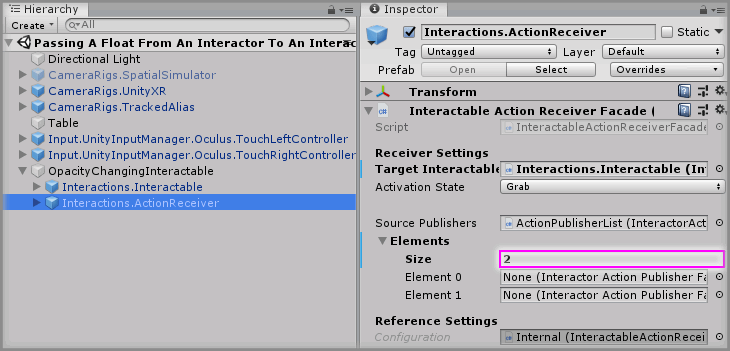
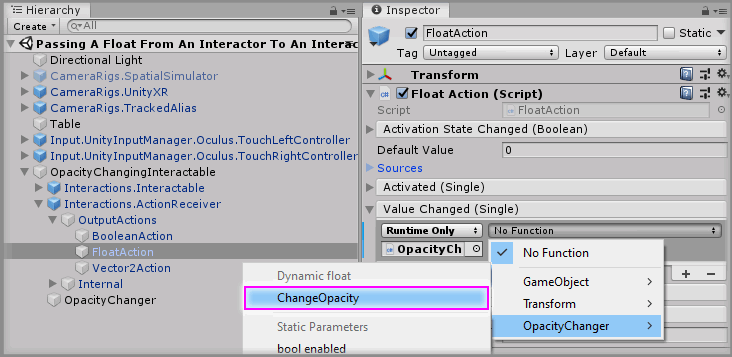

# Passing A Float From An Interactor To An Interactable

> * Level: Intermediate
>
> * Reading Time: 15 minutes
>
> * Checked with: Unity 2018.3.14f1

## Introduction 

By default, the Interactor can only pass a single boolean action over to an Interactable, which controls the grab action on the Interactable. There are other times when other actions from an Interactor may want to be passed over to an Interactable such as another input button press or even the axis value from a controller such as a trigger squeeze.

We can use the `Interactions.ActionPublisher` and `Interactions.ActionReceiver` prefabs to facilitate this mechanism.

## Prerequisites

* [Add the Tilia.Interactions.Interactor.Unity -> Interactions.Interactable] prefab to the scene hierarchy.

## Let's Start

### Step 1

We'll be using actual VR hardware for this guide as it will be easier to try out this feature if we can press a trigger whilst grabbing an interactable object with our VR controller.

Let's start by disabling the `CameraRigs.SpatialSimulator` prefab as we don't want the Simulator to activate.


Then we'll enable the `CameraRigs.UnityXR` prefab, which will serve as our generic VR CameraRig for any VR Hardware supported by the [Unity] software without the need for 3rd party plugins.


> Be sure to enable VR support for the Unity software, you can find out how to do this by reading the [Enabling Unity VR Support] step.

### Step 2

Add a `Input.UnityInputManager.Oculus.TouchLeftController` prefab to the Unity project hierarchy by selecting `GameObject -> Tilia -> Prefabs -> Input -> UnityInputManager -> ControllerMappings -> Input.UnityInputManager.Oculus.TouchLeftController` from the Unity main top menu.

> Do the same to add the `Input.UnityInputManager.Oculus.TouchRightController` prefab to the Unity project hierarchy.

### Step 3

We need to update our Interactor prefabs to listen to the Grip Button on our VR controller to grab the object. Expand `CameraRigs.TrackedAlias -> Aliases` and find the `Interactions.Interactors` prefabs nested inside the `LeftControllerAlias` GameObject and the `RightControllerAlias` GameObject.

For the `LeftControllerAlias`, expand `CameraRigs.TrackedAlias -> Aliases -> LeftControllerAlias` GameObject and click on the `Interactions.Interactor` GameObject.

Expand the `Input.UnityInputManager.Oculus.TouchLeftController -> Input Actions -> LeftGrip` GameObject then drag and drop the `LeftGrip_Press` GameObject into the `Grab Action` property on the `Interactor Facade` component of the `CameraRigs.TrackedAlias -> Aliases -> LeftControllerAlias -> Interactions.Interactor` GameObject. 



> Do the same with the right controller.

### Step 4

Add a `Interactions.ActionPublisher` prefab to the Unity project hierarchy by selecting `GameObject -> Tilia -> Prefabs -> Interactions -> Interactors -> Interactions.ActionPublisher` from the Unity main top menu and drag it into being a child of the `CameraRigs.TrackedAlias -> Aliases -> LeftControllerAlias` GameObject.

Expand the `Input.UnityInputManager.Oculus.TouchLeftController -> Input Actions -> LeftTrigger` GameObject until you can see the `LeftTrigger_Axis[9]` GameObject, select the `CameraRigs.TrackedAlias -> Aliases -> LeftControllerAlias -> Interactions.ActionPublisher` GameObject and drag and drop the `Input.UnityInputManager.Oculus.TouchLeftController -> Input Actions -> LeftTrigger -> LeftTrigger_Axis[9]` GameObject into the `Source Action` property on the `Interactor Action Publisher Facade` component.


> Do the same with the right controller.

### Step 5

Drag and drop the `CameraRigs.TrackedAlias -> Aliases -> LeftControllerAlias -> Interactions.Interactor` GameObject into the `Source Interactor` property on the `Interactor Action Publisher Facade` component.



> Do the same with the right controller.

### Step 6

Before we set up the Interactable, let's create a container GameObject for all the required logic.

Create a new `Empty` GameObject by selecting `Main Menu -> GameObject -> Create Empty` and change the Transform properties to:

* Position: `X = 0, Y = 0.6, Z = 0`

> This position matches that of the `Interactions.Interactable` GameObject

Rename the new `Empty` GameObject to `OpacityChangingInteractable`.



Then drag and drop the `Interactions.Interactable` GameObject to be a child of the `OpacityChangingInteractable` GameObject.



### Step 7

Add a `Interactions.ActionReceiver` prefab to the Unity project hierarchy by selecting `GameObject -> Tilia -> Prefabs -> Interactions -> Interactables -> Interactions.ActionReceiver` from the Unity main top menu and drag it into being a child of the `OpacityChangingInteractable` GameObject.

### Step 8

Drag and drop the `OpacityChangingInteractable -> Interactions.Interactable` GameObject into the `Target Interactable` property on the `Interactable Action Receiver Facade` component on the `OpacityChangingInteractable -> Interactions.ActionReceiver` GameObject.


### Step 9

Select the `OpacityChangingInteractable -> Interactions.ActionReceiver` GameObject in the Unity Hierarchy window then increase the `Source Publishers -> Elements -> Size` property by `2` on the `Interactable Action Receiver Facade`.

> The property will be 0 by default so change it to 2



### Step 10

Now we need to tell our `Interactions.ActionReceiver` which Action Publishers will provide the source Action data for it.

Add the two `Interactions.ActionPublisher` GameObjects we added into the `LeftControllerAlias` and the `RightControllerAlias` to the newly created Elements.

Drag and drop the `CameraRigs.TrackedAlias -> Aliases -> LeftControllerAlias -> Interactions.ActionPublisher` GameObject into the newly created `Element 0` property within the `Source Publishers` property on the `Interactable Action Receiver Facade`.

Then drag and drop the `CameraRigs.TrackedAlias -> Aliases -> RightControllerAlias -> Interactions.ActionPublisher` GameObject into the newly created `Element 1` property within the `Source Publishers` property on the `Interactable Action Receiver Facade`.


### Step 11

Expand the `OpacityChangingInteractable -> Interactions.ActionReceiver` GameObject and then expand the `OutputActions` GameObject, you'll see 3 action GameObjects.

* `Boolean Action` - This will be used if the input action from our controller is a boolean e.g. a button.
* `Float Action` - This will be used if the input action from our controller is 1D Axis e.g. a trigger press.
* `Vector2 Action` - This will be used if the input action from our controller is like a trackpad movement.

In this example we are going to use the `Float Action` because we are going to use a trigger press.

### Step 12

We'll need to create a small script that allows us to change the opacity of our interactable GameObject to test that the trigger value from the controller passes over to the interactable.

Create a new `Script` by selecting `Main Menu -> Assets -> Create -> C# Script` in the Unity software and name it `OpacityChanger`.

Copy and paste the below code into the newly created `OpacityChanger` script:

```
using UnityEngine;

public class OpacityChanger : MonoBehaviour
{
    public GameObject meshToChange;

    protected MeshRenderer materialRenderer;

    protected void OnEnable()
    {
        materialRenderer = meshToChange.GetComponentInChildren<MeshRenderer>();
    }

    public void ChangeOpacity(float value)
    {
        Color currentColor = materialRenderer.material.color;
        currentColor.a = 1f - value;
        materialRenderer.material.color = currentColor;
    }
}
```

This simple script has a single method called `ChangeOpacity` which will take a `float` value that sets the opacity of the material that is used on the GameObject.

Create a new `Empty` GameObject by right clicking on the `OpacityChangingInteractable` GameObject in the Unity Hierarchy window and selecting `Create Empty` then rename the new `Empty` GameObject to `OpacityChanger`.

Add the new `OpacityChanger` component to the `OpacityChangingInteractable -> OpacityChanger` GameObject.


### Step 13

Drag and Drop the `OpacityChangingInteractable -> Interactions.Interactable` GameObject into the `Mesh To Change` property on the `OpacityChanger` component.


> This will tell our `OpacityChanger` script to change the mesh material used by the Interactable GameObject.

### Step 14

Create a new material by selecting `Main Menu -> Assets -> Create -> Material` in the Unity software and name it `ChangingMaterial`.

Change the `Rendering Mode` property on the `ChangingMaterial` material to `Transparent`.

Then change the `Albedo` property on the `ChangingMaterial` material to another color using the color picker.


### Step 15

Drag and drop the `Assets -> ChangingMaterial` material from the Unity Project window onto the Interactable cube in the Unity scene and this will update the material being used by the Interactable.


### Step 16

Now to set up the `OpacityChanger` component to work when the trigger is pressed on either of the controllers.

Expand the `OpacityChangingInteractable -> Interactions.ActionReceiver -> OutputActions` and select the nested `FloatAction` GameObject.

Click the `+` symbol in the bottom right corner of the `Value Changed` event parameter in the `Float Action` component and then drag and drop the `OpacityChanger` GameObject into the box that appears and displays `None (Object)`.


Select a `Function` to perform when the `Value Changed` event is emitted. For this example, select the `OpacityChanger -> ChangeOpacity` (be sure to select `Dynamic float - ChangeOpacity` for this example).



### Done

Play the Unity scene, you can grab the cube with the grip button on the VR controller and then pressing the trigger button on the VR controller will slowly change the opacity of the Interactable cube GameObject.


[Add the Tilia.Interactions.Interactor.Unity -> Interactions.Interactable]: ../AddingAnInteractable/README.md
[Unity]: https://unity3d.com/
[Enabling Unity VR Support]: https://github.com/ExtendRealityLtd/Tilia.CameraRigs.UnityXR/tree/master/Documentation/HowToGuides/Installation#step-2-configuring-the-unity-project