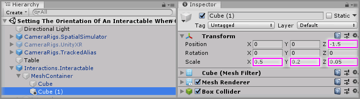
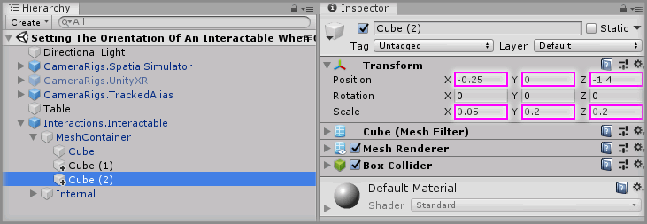
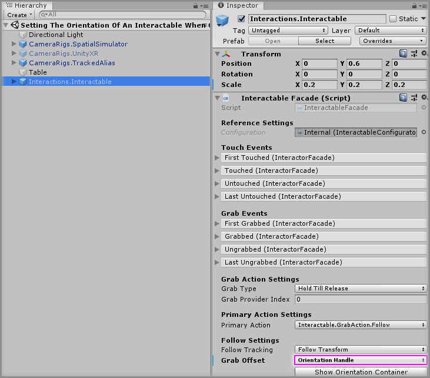
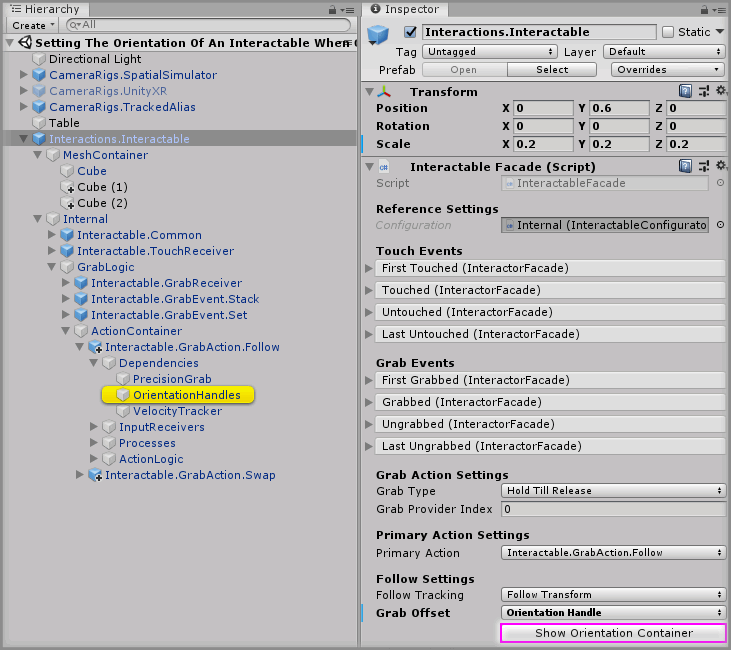
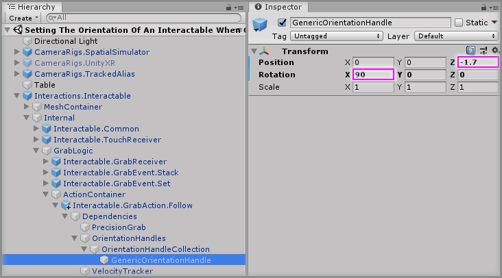
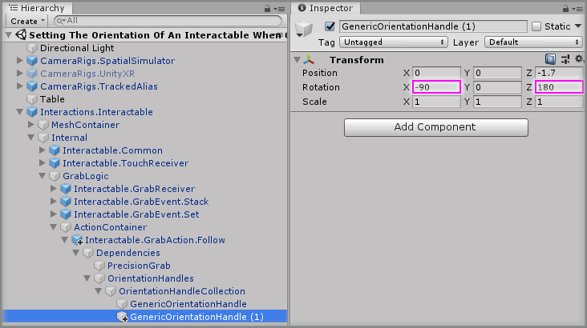
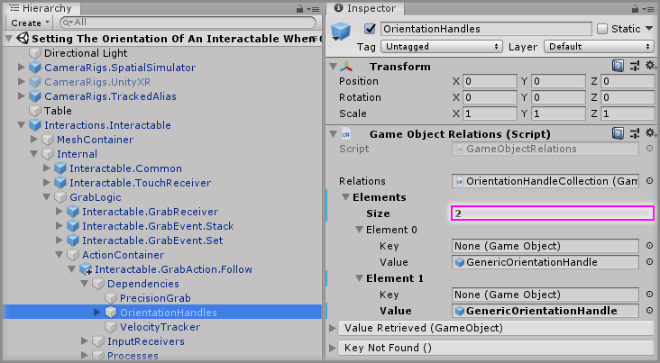
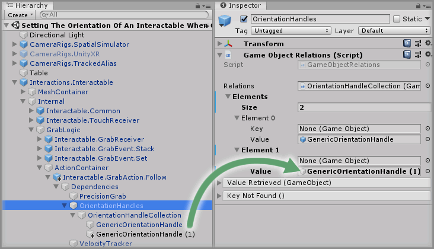
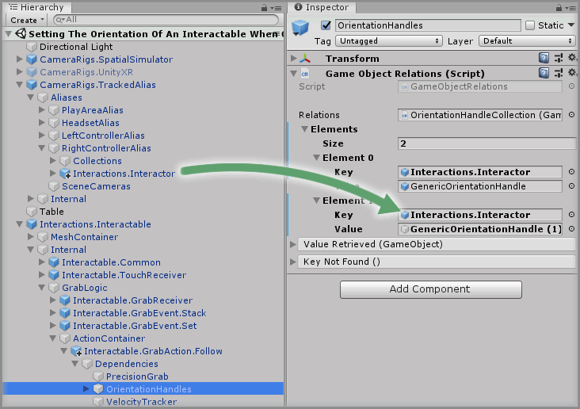
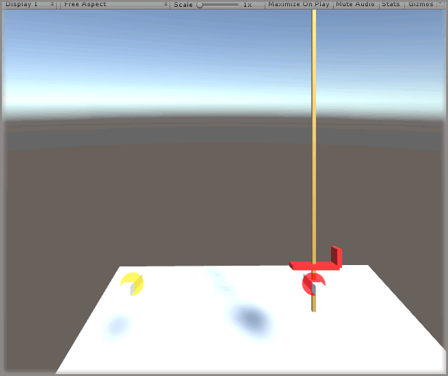

# Setting The Orientation Of An Interactable When Grabbed

> * Level: Intermediate
>
> * Reading Time: 5 minutes
>
> * Checked with: Unity 2018.3.14f1

## Introduction

The default way of grabbing an Interactable is to have the origin of the Interactable snap to the origin point of the Interactor. This mechanism works fine for basic grabbing, but sometimes when you want to grab a certain object you may want to orientate the Interactable in a certain position and rotation to the Interactor.

A good example of this is when you grab a sword, you would want the sword Interactable to naturally orientate itself to the grabbing controller Interactor so it feels like you're actually holding a sword. We can achieve this orientation on grab by using the `Grab Offset` property on the `Interactable Facade` component to determine how our Interactable is orientated on grab.

## Prerequisites

* [Add the Tilia.Interactions.Interactor.Unity -> Interactions.Interactable] prefab to the scene hierarchy.

## Let's Start

### Step 1

First we are going to turn the Interactable cube into a shape that is better to orientate such as a sword, select the `Interactions.Interactable -> Mesh Container -> Cube` GameObject and change the Transform properties to:

* Scale: `X = 0.04`, `Y = 0.04`, `Z = 4`

With the `Cube` GameObject still selected, go to `Main Menu -> Edit -> Duplicate`.

With the `Interactions.Interactable -> Mesh Container -> Cube(1)` GameObject selected change the Transform properties to:

* Position: `X = 0`, `Y = 0`, `Z = -1.5`
* Scale: `X = 0.5`, `Y = 0.2`, `Z = 0.05`

Select the `Cube` GameObject again and go to `Main Menu -> Edit -> Duplicate`.

With the `Interactions.Interactable -> Mesh Container -> Cube(2)` GameObject selected change the Transform properties to:

* Position: `X = -0.25`, `Y = 0`, `Z = -1.4`
* Scale: `X = 0.05`, `Y = 0.2`, `Z = 0.2`

> It may be easier at this point to apply different materials to the sword to make it easier to see what it is supposed to be.

### Step 2

Select the `Interactions.Interactable` GameObject from the [Unity] Hierarchy window and change the `Grab Offset` property value to `Orientation Handle` on the `Interactable Facade` component.

To quickly access the `Orientation Container` click `Show Orientation Container` Button on the `Interactable Facade` component. Notice how the `Interactions.Interactable` GameObject has automatically expanded to show the `OrientationHandles` GameObject.

### Step 3

Expand the `OrientationHandles -> OrientationHandleCollection` GameObject and select the `GenericOrientationHandle` GameObject and set the Transform properties to:

* Position: `X = 0`, `Y = 0`, `Z = -1.7`
* Rotation: `X = 90`, `Y = 0`, `Z = 0`

Play the Unity scene and grab the sword with either controller. You will notice it orientates so that the sword is pointing upwards in the hand of the controller, however the sword guard always points to the left.

### Step 4

We want to make sure the sword always has the guard pointing outwards whether we grab with the left or the right controller so to do this we can set up a different Orientation Handle per controller.

Select the `OrientationHandles -> OrientationHandleCollection -> GenericOrientationHandle` GameObject and go to `Main Menu -> Edit -> Duplicate` and with the `OrientationHandles -> OrientationHandleCollection -> GenericOrientationHandle (1)` GameObject selected, change the Transform properties to:

* Rotation: `X = -90`, `Y = 0`, `Z = 180`

### Step 5

We need to now tell the Orientation Handle logic to use one `OrientationHandle` GameObject when we grab with the left controller and use a different `OrientationHandle` GameObject when we grab with the right controller.

Select the `OrientationHandles` GameObject from the Unity Hierarchy window then increase the `Relations -> Elements -> Size` property value by `1` on the `GameObject Relations` component.

> The size property will be `1` by default, so change it to `2`.

### Step 6

Drag and drop the `OrientationHandles -> OrientationHandleCollection -> GenericOrientationHandle (1)` GameObject into the `Relations -> Elements - Element 1 -> Value` property on the `GameObject Relations` component.

### Step 7

We have two different Orientation Handles that we can choose from when grabbing this Interactable. We now need to instruct the `Game Object Relations` component on the correct orientation handle to use based on the controller that is doing the grabbing.

Drag and drop the `CameraRigs.TrackedAlias -> Aliases -> LeftControllerAlias -> Interactions.Interactor` GameObject into the `Relations -> Elements -> Element 0 -> Key` property on the `GameObject Relations` component.

Do the same for the right controller and drag and drop the `CameraRigs.TrackedAlias -> Aliases -> RightControllerAlias -> Interactions.Interactor` GameObject into the `Relations -> Elements -> Element 1 -> Key` property on the `GameObject Relations` component.

> This specifies that when we grab with the left controller it should use the `GenericOrientationHandle` GameObject and when we grab with the right controller it should use the `GenericOrientationHandle (1)` GameObject, which will give us mirrored rotation allowing the guard to always be facing outwards.

### Done

Play the Unity scene, Grab with the right controller and notice the guard is facing outwards.

 

Then Grab with the left controller and notice the orientation is rotated so that the guard is still facing outwards.

[Add the Tilia.Interactions.Interactor.Unity -> Interactions.Interactable]: ../AddingAnInteractable/README.md
[Unity]: https://unity3d.com/